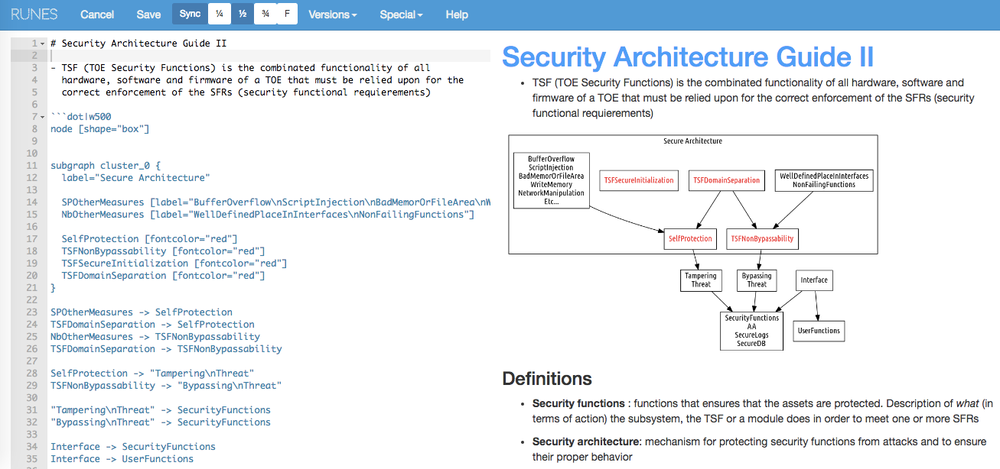

[](https://travis-ci.org/adriamb/runes) [](https://goreportcard.com/report/github.com/adriamb/runes)

[]()

[]()

runes is a notepad web application, with the following features:

- Blog style, sequential entries
- Workspaces to group entries by project
- **Markdown** support with github flavour
- **Realtime render**: All data written in the markdown are automatically rendered, with support for
  - **Graphviz** (see http://www.graphviz.org/)
  - **Goat**  (see https://github.com/blampe/goat)
  - **Js Sequence diagrams** (see https://bramp.github.io/js-sequence-diagrams/)
  - **Js Flowchart** (see http://flowchart.js.org/)
- **Attachments** support, just drag&drop
- **Page changes** are kept and versioned
- **No database** , all data are written into the filesystem. If you want to backup the data, just copy the folder, or create a git repo for it.
- **No data is overwritten**, attachments cannot be overwritten
- **Google OAuth2** support, if you want you can push your blog in a public space and log into with your google account.

## Installation

Install the runes with

`go get github.com/adriamb/runes`

initialize the repository

`runes create`

then, start the runes 

`runes start`

go to a browser `http://localhost:8086`

## Fast test with docker

If you want to test the application, clone the repo

`git clone https://github.com/adriamb/runes`

go to the docker folder

`cd docker`

run docker-compose

`docker-compose up`

go to a browser `http://localhost:8086`

all files generated will be kept in the `docker/data`, take a look

## Configuration file

runes uses the following configuration file, by default located in $HOME/.runes.yaml but you can specify it with the `--config` command line parameter.

```yaml
port: <server port, e.g. 8086>
datadir: <where data is stored, by default is $HOME/.runes>
tmpdir: <temp directory, by default is /tmp/runes/tmp>
cachedir: <cache directory, by default is /tmp/runes/tmp>
auth:
    type: <'none' or 'google'>
    googleclientid: <google oauth2 clientid>
    allowedemails:
        - <email of allowed oauth client>
        - <email of allowed oauth client>
```

## Dropping files

To add files, just drop the file into the markdown edit box. The file will be added to the
filesystem and a link will be created inside the markdown text.

You can access the file with the created link or using the Files menu item.


